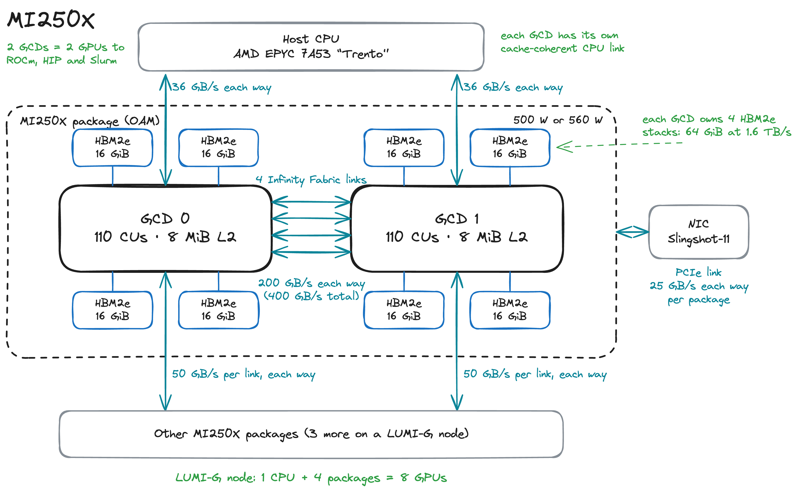
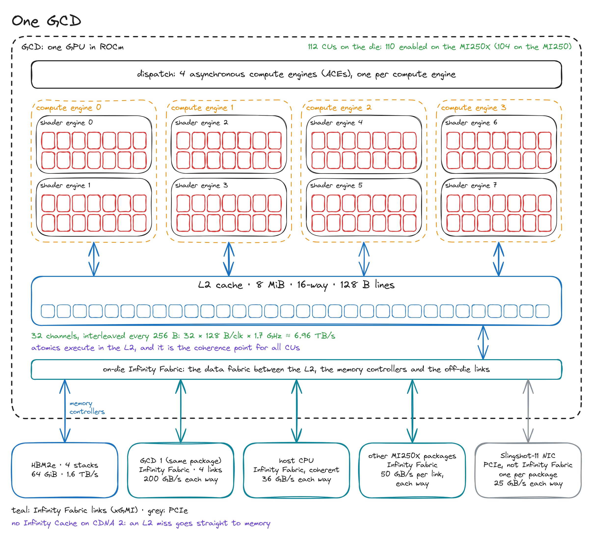
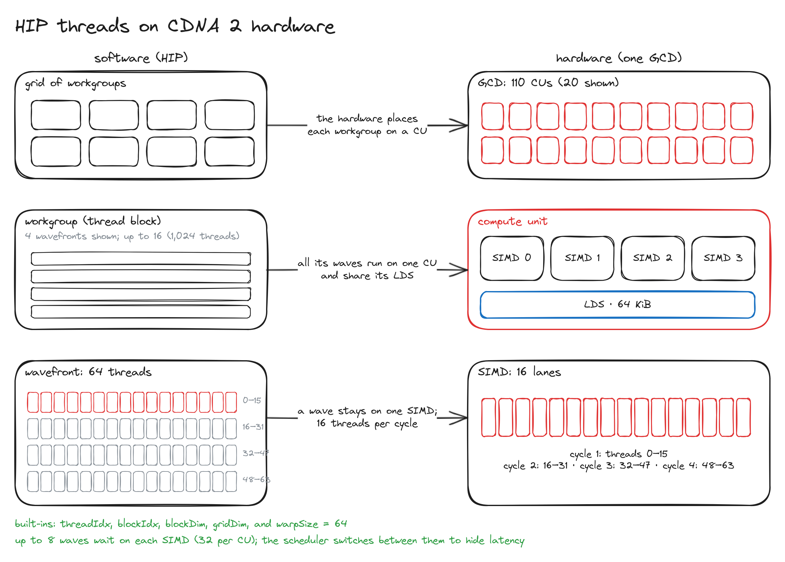
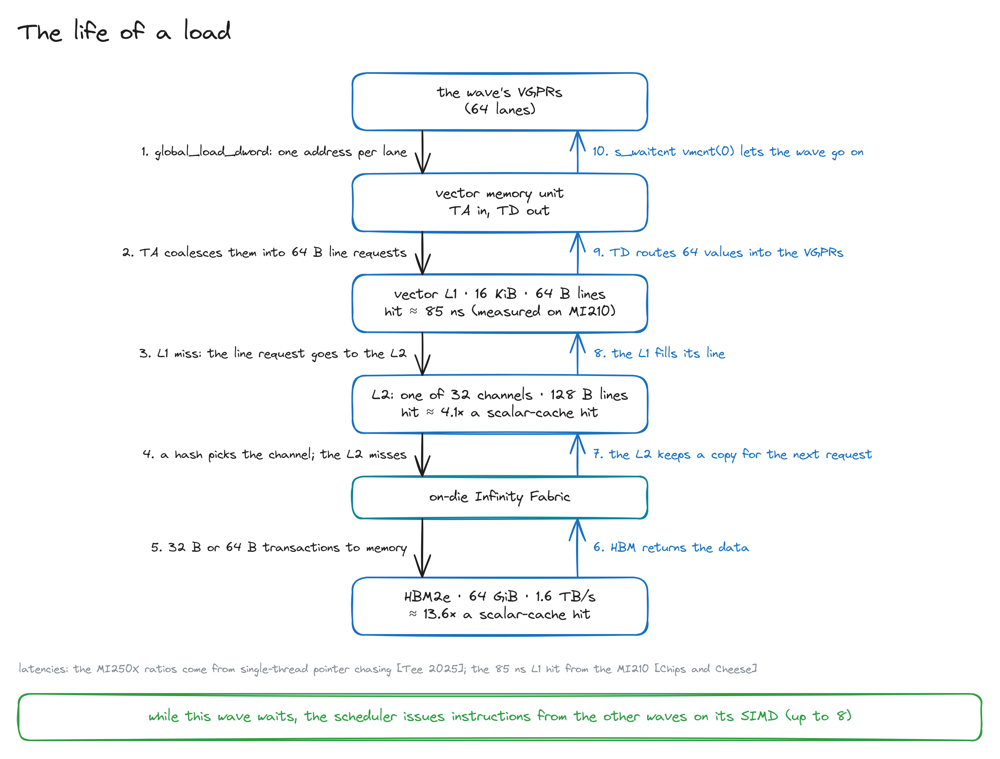
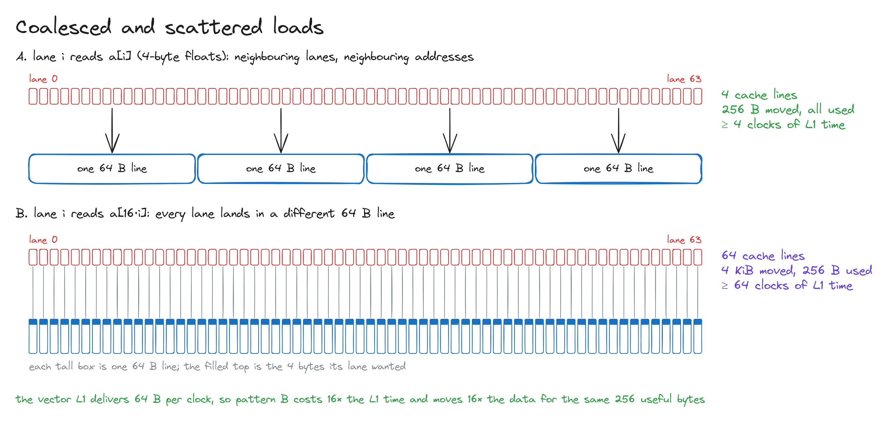
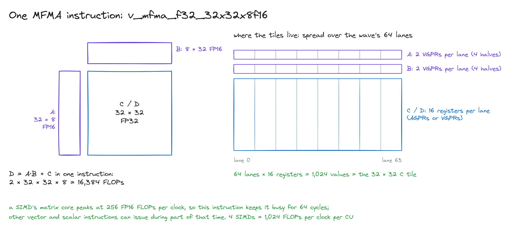

A GPU does two things. It moves data, and it computes on it. The computing is the cheap part: a modern GPU can do arithmetic far faster than its memory can feed it. So most of the chip, and most of the craft of writing fast kernels, is about getting data to the right place at the right time.

Aleksa Gordić's *Inside NVIDIA GPUs: Anatomy of high performance matmul kernels* [1] is the clearest account of this I know. Before he writes a single kernel, he builds a working model of the H100: its memory hierarchy, its compute units, its programming model, and how global memory, shared memory and L1 behave. I wanted the same model for AMD GPUs and could not find one. So I wrote it.

My GPU is the AMD Instinct MI250X. It powers LUMI, the EuroHPC supercomputer that CSC hosts in Kajaani, Finland, and it is where I run most of my work. I don't have access to other AMD GPUs, so this post is about the MI250X.

The scope is anatomy only. Where does data live? How does it travel to the lanes and wavefronts that do the work? How is it computed, how is it written back, and how is it shared? There is no kernel code here. We will write a GEMM kernel in Triton from scracth and run on one MI250X on LUMI, profile it and make it faster, and it stands on everything below.

Quick note before we start: Numbers are per GCD, one of the two dies in the package, unless I say otherwise. Peak figures assume the 1.7 GHz peak engine clock [2]. Along the way you will find two interactive diagrams to click through.

## One package, two GPUs

The MI250X is not one big GPU. Open the package (Fig. 1) and you find two graphics compute dies, or GCDs, side by side, each with memory of its own.



Each GCD is a complete GPU: 110 compute units, an 8 MiB L2 cache and 64 GiB of HBM2e in four stacks, with 1.6 TB/s of bandwidth [3, 4, 5, 6]. ROCm, HIP and Slurm treat each GCD as a separate device. A LUMI-G node has one 64-core AMD EPYC 7A53 "Trento" CPU and four MI250X packages, so it shows eight GPUs [3].

The two dies talk over four Infinity Fabric links: 200 GB/s in each direction in total, 400 GB/s counting both [3, 5]. That is fast for a link and slow for memory: a GCD's peak bandwidth to its own HBM is eight times its peak bandwidth to its sibling's.

Everything else is further away still. Each GCD has its own cache-coherent link to the CPU, at 36 GB/s each way [2, 7]. Links between packages run at 50 GB/s per link each way, and on LUMI two GCDs on different packages that are linked directly have one or two such links [3, 5]. The Slingshot-11 network card gives each package 25 GB/s each way [3]. A package is rated at 500 W or 560 W [2].

So treat the MI250X as two GPUs that happen to share a package. A kernel runs on one GCD and sees that GCD's memory at full speed. Data on the other die is a trip over the links away, and we will put a price on that trip later.

> **Coming from NVIDIA?** An H100 is one large die. An MI250X is closer to two GPUs on one card with a fast link between them. On LUMI, Slurm hands out GCDs, so "one GPU" in your job script means one GCD.

## Inside one GCD

Zoom into one die (Fig. 2).



The die has 112 compute units, or CUs. The MI250X enables 110 of them and the MI250 enables 104 [3, 4]. They are organized in four compute engines of two shader engines each, 14 CUs per shader engine on the die. Four asynchronous compute engines (ACEs), one per compute engine, dispatch work onto them [6]. The names are easy to mix up: a compute engine is a group of CUs, while an ACE is part of the front end that reads kernel launches from queues and sends their workgroups to CUs. The grouping matters to the hardware's scheduling more than to your code.

Below the CUs is the only cache they all share: the L2. It holds 8 MiB, is 16-way set associative and is split into 32 channels [3, 6, 8]. Below the L2, the on-die Infinity Fabric connects to the four HBM2e stacks, to the links to the other GCD, and to the links that leave the package.

Two things are missing compared with newer GPUs. There is no cache behind the L2: CDNA 2 has no Infinity Cache, so an L2 miss goes straight to HBM [9]. And there is no counterpart to the H100's thread block clusters or distributed shared memory. Compute units exchange data through the L2.

## Inside a compute unit

The compute unit is where the work happens (Fig. 3).


A CU has four SIMDs. Each SIMD has a 16-lane vector ALU, a matrix core that runs MFMA (matrix fused multiply-add) instructions, slots for up to eight wavefronts, and a register file of 512 registers × 64 lanes × 4 bytes = 128 KiB [4, 10, 11]. That file holds two kinds of vector registers: ordinary VGPRs, and AGPRs, which CDNA introduced as accumulators for the matrix cores [10].

A wavefront is AMD's warp: 64 threads that execute the same instruction together [12]. A SIMD has only 16 lanes, so it runs each vector instruction of a wavefront in four passes, one per clock: threads 0 to 15, then 16 to 31, 32 to 47 and 48 to 63 [3, 13].

Every clock, the CU's scheduler turns to one of the four SIMDs in round-robin order. It can issue up to five instructions there, each of a different type and each from a different wavefront [14]. A SIMD gets a turn every fourth clock and a vector instruction takes four clocks, so the cadence lines up: each SIMD can start a new vector instruction every four clocks.

Next to the SIMDs sits the scalar unit: one scalar ALU per CU, with 12.5 KiB of scalar registers (SGPRs), 800 per SIMD [4, 11]. Work that is the same for all 64 threads of a wavefront, such as a loop counter, a branch condition or a base address, runs here once instead of 64 times. The scalar cache (16 KiB) and the instruction cache (32 KiB) are each shared by two neighbouring CUs [4].

At the bottom of the CU are the two memories every kernel writer cares about. The local data share (LDS) is 64 KiB of fast memory that the program manages itself. It is split into 32 banks that together deliver 128 bytes per clock [4, 15], and it is AMD's name for what CUDA calls shared memory. The vector memory unit handles loads and stores. Its texture addressing unit (TA) gathers the 64 addresses of a wavefront and coalesces them, and its texture data unit (TD) returns the results to registers [15]. The names are left over from the texture units of graphics GPUs, and you will meet them again in ROCm Compute Profiler, next to TCP (texture cache per pipe, the vector L1) and TCC (texture cache per channel, the L2). Behind the vector memory unit sits a 16 KiB vector L1 cache with 64-byte lines [4, 16].

The LDS and the L1 are separate SRAMs. On the H100, shared memory and L1 are carved from the same array [1], and the split between them is configurable. On CDNA 2 there is nothing to choose: 64 KiB of LDS and 16 KiB of L1, always. There is also no tensor memory accelerator (TMA). Wavefronts move data into the LDS themselves, almost always by way of their registers.

### Parallelism versus concurrency

Aleksa draws a distinction that is worth repeating here, because the numbers differ on AMD [1].

*Parallelism* is how many threads do work in the same clock. Each SIMD processes 16 lanes per clock, so a CU processes 64 and a GCD 110 × 64 = 7,040. Count both dies and you get the 14,080 "stream processors" on the MI250X datasheet [2].

*Concurrency* is how many threads are resident, with registers allocated and ready to run. Each SIMD holds up to eight wavefronts [14, 17], so a CU holds 32 wavefronts, or 2,048 threads, and a GCD 225,280.

Concurrency is 32 times parallelism. The extra wavefronts are not there to run at the same time. They are there to wait. When one wavefront stalls on a load, the scheduler issues from another, and the SIMD stays busy. A GPU hides memory latency by always having other work ready, not by making memory faster.

For comparison, an H100 SM issues from at most four warps per clock, 128 threads, and also keeps up to 2,048 threads resident [1].

### A short dictionary

If you know CUDA, this table translates the terms used in the rest of the post.

| NVIDIA and CUDA | AMD and HIP on CDNA 2 |
| --- | --- |
| Streaming multiprocessor (SM) | Compute unit (CU) |
| SM sub-partition | SIMD |
| Warp, 32 threads | Wavefront, 64 threads |
| Thread block | Workgroup |
| Shared memory | Local data share (LDS) |
| L1 cache | Vector L1 cache |
| Global memory | Global memory, in HBM2e |
| Local memory | Scratch (private) memory |
| Tensor Core | Matrix core, running MFMA instructions |
| CUDA core | Stream processor, one SIMD lane |
| Uniform datapath | Scalar unit and SGPRs |
| NVLink | Infinity Fabric |
| `__syncthreads()` | `__syncthreads()`, compiled to `s_barrier` |
| Warp shuffles | Cross-lane operations: DPP, `ds_swizzle`, `ds_bpermute` |

> **Try it on LUMI.** On a GPU node, `rocminfo` lists every GCD in your allocation as its own agent. Load the `rocm` module first if the command is not on your path.
>
> ```bash
> rocminfo | grep -E "Marketing Name|Compute Unit|SIMDs per CU|Wavefront Size"
> ```
>
> Each GCD reports 110 compute units, 4 SIMDs per CU and a wavefront size of 64. The CPU shows up in the list too.

### Explore it: the overview

<style>
/* The interactive embeds are wider than the text column, so the diagrams fit without sideways scrolling. */
.prose .mi250x-embed { align-self: center; width: min(1120px, calc(100vw - 32px)); }
.prose .mi250x-embed iframe { display: block; width: 100%; border: 1px solid var(--rule); border-radius: 12px; }
</style>

<script>
(function () {
  var root = document.documentElement;
  var frames = function () { return document.querySelectorAll("iframe[data-autoheight]"); };

  // Each embedded page reports its height, so its iframe grows to fit.
  window.addEventListener("message", function (e) {
    if (!e.data || e.data.type !== "mi250x-embed") return;
    frames().forEach(function (f) {
      if (f.contentWindow === e.source) f.style.height = e.data.height + "px";
    });
  });

  // The embedded pages use the site's light or dark theme, also after the toggle is clicked.
  function applyTheme() {
    var theme = root.dataset.theme;
    if (theme !== "light" && theme !== "dark") return;
    frames().forEach(function (f) {
      var url = new URL(f.src);
      if (url.searchParams.get("theme") === theme) return;
      try {
        var page = f.contentDocument && f.contentDocument.documentElement;
        if (page && page.classList.contains("is-embed")) { page.setAttribute("data-theme", theme); return; }
      } catch (err) {}
      url.searchParams.set("theme", theme);
      f.src = url.href;
    });
  }
  document.addEventListener("DOMContentLoaded", applyTheme);
  new MutationObserver(applyTheme).observe(root, { attributes: true, attributeFilter: ["data-theme"] });
})();
</script>

<figure class="mi250x-embed">
<iframe src="/interactive/mi250x-glance.html?embed" title="The MI250X at a glance: an interactive diagram of one GCD" loading="lazy" data-autoheight style="height:1400px"></iframe>
<figcaption>The MI250X at a glance. Click any block, or press one of the two walkthroughs. <a href="/interactive/mi250x-glance.html" target="_blank" rel="noopener">Open full screen ↗</a></figcaption>
</figure>

This page combines Fig. 2 and Fig. 3 into one clickable diagram. One GCD is drawn from top to bottom: math units at the top, memory below them, and the links to the outside world at the bottom. CU 1 and CU 110 are drawn open; the other 108 are identical. Click a block, and the card next to or below the diagram explains what it does, lists the blocks it connects to with the bandwidth of each link, and names what plays the same role on NVIDIA GPUs. Some things to try:

- Click **LDS** in CU 1. Nothing outside that CU lights up: the LDS is private to its compute unit.
- Click **L2 cache**. Now the links to every CU light up, along with HBM and the off-die links. The L2 is where all 110 CUs meet.
- Click **Vector ALU** and watch the small animation: 64 threads pass through 16 lanes in four clocks.
- Press **Follow a load** and step through it: registers, load/store unit, vector L1, L2, HBM, and back up.
- Press **Follow a matrix multiply** to see why the LDS exists: a tile comes in once and is reused many times before the result goes back out.

Each card ends with a link into the full anatomy explorer, which we will use later in the post.

## From HIP threads to hardware

HIP, AMD's CUDA-like language, uses the same thread hierarchy as CUDA (Fig. 4). A kernel launch creates a grid of workgroups, CUDA's thread blocks. A workgroup holds up to 1,024 threads, and the hardware splits it into wavefronts of 64 [12]. Each thread finds its place with the familiar built-ins `threadIdx`, `blockIdx`, `blockDim` and `gridDim`. One more built-in matters on AMD: `warpSize`, which is 64 on CDNA GPUs and 32 on RDNA GPUs [12].



Three rules connect the two sides:

1. **A workgroup runs on one CU.** All its wavefronts live on the same CU, so they can share its LDS and meet at a barrier [12, 18]. A CU can host several workgroups at once when resources allow. (The one exception is an opt-in `tgsplit` mode on gfx90a, which lets a workgroup's wavefronts spread over several CUs and gives up the LDS to do it [18].)
2. **A wavefront runs on one SIMD.** Its registers live in that SIMD's register file, so it stays there until it finishes. The wavefronts of one workgroup may run on different SIMDs of the CU [18].
3. **Workgroups run in no promised order.** The dispatcher places them on CUs as space frees up. In a normal launch they have no barrier to wait for each other, so results from different workgroups usually meet in a later kernel.

### Lockstep and the EXEC mask

The 64 threads of a wavefront share one instruction stream. Suppose they reach `if (x[i] > 0)` and some threads find the condition true while others find it false. This is called divergence, and the hardware does not split the wavefront to handle it. It runs both sides, one after the other, and uses a 64-bit execution mask, EXEC, to switch off the lanes that should sit out [10]. A lane whose EXEC bit is 0 computes nothing and writes nothing. A vector compare such as `v_cmp` evaluates the condition in every lane and produces a 64-bit mask, and a scalar instruction such as `s_and_saveexec_b64` loads it into EXEC [11]. When no lane is active on one side, a scalar branch can skip that side entirely [10].

Two consequences follow. Divergence inside a wavefront costs time, because both paths run. And code written for 32-thread warps, with a hard-coded 32 in a reduction or a 32-bit lane mask, is wrong on a 64-thread wavefront. Use `warpSize`.

### Occupancy

How many wavefronts can a CU hold at once? This number is the occupancy, and on CDNA 2 two resources usually decide it.

**Vector registers.** Each SIMD has 512 vector registers per lane, shared by all its wavefronts. A wavefront whose threads each use $R$ vector registers, VGPRs plus AGPRs, allocated in blocks of 8, leaves room for

$$
\text{waves per SIMD} = \min\left(8,\ \left\lfloor \frac{512}{R} \right\rfloor\right)
$$

wavefronts [17, 19]. A kernel that needs 64 registers per thread keeps all 8 wavefronts per SIMD. At 128 registers, 4 fit. At 256, only 2.

**LDS.** The 64 KiB of LDS is divided among the workgroups on a CU. A workgroup that allocates 32 KiB leaves room for one more. A workgroup that allocates all 64 KiB runs alone.

The tightest limit wins. Occupancy is a means, not a goal: more resident wavefronts give the scheduler more ways to hide memory latency. Fast kernels sometimes trade occupancy for more registers per thread, and we will meet that trade in the next post.

## The memory hierarchy

Why is there a hierarchy at all? Physics, as Aleksa explains [1]. Static RAM (SRAM) stores a bit in a few transistors. It is fast but takes area, so there is little of it, and it sits next to the ALUs: registers, the LDS and the caches. Dynamic RAM (DRAM) stores a bit as charge in one capacitor behind one transistor. It is dense and cheap per bit but slower, so it holds the bulk of the data, in stacks beside the die. Every level in between trades capacity for speed.

Fig. 5 puts the whole hierarchy of one GCD on a single page, in the style of Aleksa's H100 diagram.


Here are the levels side by side, for one GCD [3, 4, 5, 9, 15, 20, 21]:

| Level | Capacity | Shared by | Peak bandwidth | Latency |
| --- | --- | --- | --- | --- |
| Registers (VGPR + AGPR) | 512 KiB per CU, 55 MiB in total | one wavefront | not published | none: instructions read them directly |
| LDS | 64 KiB per CU, 6.9 MiB in total | one workgroup | 128 B per clock per CU, 23.9 TB/s in total | much lower than the vector L1 (MI210) |
| Vector L1 | 16 KiB per CU, 1.7 MiB in total | one CU | 64 B per clock per CU, 12.0 TB/s in total | just over 85 ns (MI210) |
| Scalar cache | 16 KiB per pair of CUs | two CUs | not published | 37.5 ns (MI210) |
| L2 | 8 MiB | the whole GCD | 6.96 TB/s | about 4.1 × a scalar-cache hit |
| HBM2e | 64 GiB | the whole GCD | 1.6 TB/s | about 13.6 × a scalar-cache hit |

Two things stand out. The register files of one GCD hold 55 MiB, more than the L2, the LDS and the L1 combined. And bandwidth falls about fifteenfold from the LDS to HBM. A kernel that finds its data in the upper rows runs fast. A kernel that keeps going back to the bottom row does not.

Aleksa's sections on GMEM, SMEM and L1 map onto HBM2e, the LDS and the vector L1 here. I add the L2 and the registers, because on the MI250X they deserve sections of their own. We go from the bottom up.

### HBM2e: global memory

Global memory lives in HBM2e: four stacks per GCD, 64 GiB in total [6], on a 4,096-bit interface, half of the package's 8,192 bits, clocked at 1.6 GHz [2]. Data moves on both clock edges, which gives the peak bandwidth:

$$
\frac{4096\ \text{bit} \times 1.6\ \text{GHz} \times 2}{8\ \text{bit/B}} \approx 1.64\ \text{TB/s}
$$

AMD quotes this as 1.6 TB/s per GCD and 3.2 TB/s per package [2, 5].

Everything a kernel reads from or writes to `hipMalloc` memory lives here. So do two less obvious things. `__constant__` data sits in HBM too. When all threads of a wavefront read the same constant, the compiler can fetch it with one scalar load, through the scalar cache [18]. And when a kernel runs out of registers, the compiler spills them to scratch memory, CUDA's local memory, which is also backed by HBM and reached through the same caches [18].

DRAM has a quirk that shapes everything above it. Its cells sit in a grid of rows and columns. To read a cell, the chip first copies its whole row into a row buffer. Reading more of that row is then cheap, and opening a different row costs time. Aleksa draws this nicely [1]. The practical rule is the same on AMD: neighbouring threads should touch neighbouring addresses, so that each row opened and each cache line fetched is used in full.

Now the number that drives the rest of this post. Share 1.6 TB/s evenly among 110 CUs running at 1.7 GHz, and each CU gets

$$
\frac{1.6\ \text{TB/s}}{1.7\ \text{GHz} \times 110} \approx 8.6\ \text{bytes per clock}.
$$

A CU's matrix cores can do 1,024 FP16 FLOPs per clock [5]. To keep them busy on data streamed from HBM, every byte would have to feed about 120 FLOPs. That is only possible if each byte, once loaded, is reused many times from faster storage. The levels above HBM exist to make that reuse possible.

HBM is also the slowest level to reach. Tee measured the MI250X with a single thread chasing pointers and reports the latency of each level relative to a scalar-cache hit: about 4.1 times for an L2 hit and 13.6 times for HBM [9]. The MI210, a one-die CDNA 2 GPU with the same compute unit, has a measured scalar-cache hit of 37.5 ns [21]. Put the two together and you get roughly 150 ns for an L2 hit and 510 ns for HBM. Treat that as an estimate, because it mixes two studies and two GPUs.

### L2: where the CUs meet

The L2 is the only cache that every CU of a GCD shares, and the place where their views of memory come together. It holds 8 MiB, is 16-way set associative and works in 128-byte lines [3, 6, 8]. It is split into 32 channels. Addresses are interleaved across the channels every 256 bytes, and a hash spreads them out so that the channels work in parallel [8]. Each channel delivers 128 bytes per clock:

$$
32 \times 128\ \text{B} \times 1.7\ \text{GHz} \approx 6.96\ \text{TB/s}.
$$

That is the peak [3]. Shared by 110 busy CUs, it comes to about 37 bytes per clock each. Chips and Cheese measured 3.7 TB/s on the MI210 [21], so plan for well below the peak.

When the L2 misses, it fetches from memory over the Infinity Fabric in 32- or 64-byte transactions [8]. There is no further cache on the way, because CDNA 2 has no Infinity Cache [9].

The L2 has three jobs beyond caching:

- **Coherence.** All CUs of a GCD use the same L2, so a write that has reached the L2 is visible to every CU on the die [18].
- **Atomics.** Atomic operations on the GCD's own memory, including FP64 atomics, execute in the L2, next to the data [3, 6].
- **Write-back.** For ordinary device memory, the L2 can hold modified lines and write them to HBM later [18].

### Vector L1 and the scalar cache

Each CU has a 16 KiB vector L1 with 64-byte lines. It delivers 64 bytes per clock [4, 16, 20]. On the MI210, a hit takes just over 85 ns [21], so even a hit is far from free.

Think of the vector L1 as a staging buffer more than a place to keep a working set. Shared by up to 32 resident wavefronts, 16 KiB is 512 bytes per wavefront, two 4-byte values per thread. Its job is to merge the requests of a wavefront and to catch reuse that happens close together in time.

It is also write-through: stores pass through it to the L2 [15]. And it is not kept coherent with the L1s of other CUs. When one workgroup must see data that another workgroup wrote, the L1 has to be invalidated at the synchronization point. The compiler does this (with `buffer_wbinvl1_vol`) as part of an acquire atomic or a device-scope fence such as `__threadfence()` [18]. A plain relaxed atomic, like the default `atomicAdd`, does not do it. Inside one workgroup none of this is needed, because all its wavefronts use the same L1 [18].

Uniform data takes a separate path. The scalar cache, 16 KiB shared by two CUs, serves scalar loads into SGPRs [4]. On the MI210 a hit takes 37.5 ns, less than half the vector L1's latency [21]. The compiler uses it only for data that cannot change while the kernel runs, such as kernel arguments and constants [18].

### LDS: AMD's shared memory

The local data share is the memory you manage yourself. Each CU has 64 KiB of it, and one workgroup can allocate all of it [4]. The LDS belongs to the workgroup: every wavefront of the workgroup can read and write it, no other workgroup can see it, and its contents are gone when the workgroup ends.

The LDS is built from 32 banks, each 4 bytes wide. Consecutive 4-byte words go to consecutive banks:

$$
\text{bank} = \left\lfloor \frac{\text{byte address}}{4} \right\rfloor \bmod 32
$$

Each bank serves one word per clock, so the LDS delivers 32 × 4 = 128 bytes per clock to its CU [15]. If several threads in the same clock need *different* words from the *same* bank, the bank serves them one after another. That is a bank conflict (Fig. 6).

![Two rows of 32 lanes above 32 LDS banks. In A, lane i reads a[i] and each lane hits its own bank in one pass. In B, lane i reads a[32 times i] and every lane hits bank 0, which takes 32 passes. A note says padding each row to 33 floats fixes it](./mi250x-anatomy-figure-6.png "Fig. 6. LDS banks. A: threads read consecutive floats and hit 32 different banks in one pass. B: threads read down a column of a 32-wide tile and all hit bank 0, which takes 32 passes. Padding each row to 33 floats fixes it.")

Which threads count as the same clock? A wavefront has 64 threads, but the LDS serves 128 bytes per clock, so a wavefront's access is split into phases. A kernel optimization guide for CDNA 3, whose LDS has the same 32 banks of 4 bytes, describes the split: two phases of 32 lanes for 4-byte accesses, four phases of 16 lanes for 8-byte accesses, and eight phases for 16-byte accesses [22]. AMD's Composable Kernel documentation describes the same eight phases for 16-byte writes [23]. I have not found this table written down for CDNA 2, but the bank layout is the same. Conflicts only matter within a phase. Threads that read the *same* address do not conflict at all, because the value is broadcast [22].

The classic fix for Fig. 6B is padding. Make each row of a 32-float tile 33 floats long, and element $(i, j)$ moves to bank $(33i + j) \bmod 32 = (i + j) \bmod 32$, so a column read touches 32 different banks. Swizzling, which permutes the column index with an XOR, does the same job without wasting space. Triton applies it for us when it stages tiles in the LDS, and the next post shows where to see that.

Why go to this trouble? Look at the budget again. The LDS gives its CU 128 bytes per clock; the CU's fair share of HBM is about 8.6. A tile loaded from HBM once and then read many times from the LDS, by every wavefront of the workgroup, multiplies the useful bandwidth. That is the whole idea behind tiling. The LDS is also quick to reach: on the MI210, an LDS access has much lower latency than a vector L1 hit [21].

How does data get into the LDS? Usually through registers. A wavefront loads from global memory into its VGPRs, then writes the values into the LDS with `ds_write`. CDNA 2 also has a shortcut, `buffer_load ... lds`, which writes the loaded data straight into the LDS, but only 1, 2 or 4 bytes per lane [10, 19]. There is no asynchronous copy engine like NVIDIA's TMA.

### Registers

At the top of the hierarchy sit the registers, and on the MI250X they are the largest on-chip memory of all.

*VGPRs*, vector general-purpose registers, hold one 32-bit value per thread. *AGPRs*, accumulation registers, came with CDNA's matrix cores. On CDNA 2 both live in the same file of 512 registers per lane in each SIMD, and a wavefront can use up to 256 of each [10, 11]. Loads, stores and MFMA instructions can use either kind [10, 19]. *SGPRs* hold one 32-bit value per wavefront, for the things all 64 threads share [11].

Instructions read their operands straight from the register file, so there is no access latency to speak of, and AMD does not publish a bandwidth figure for it. Registers are also the only on-chip storage private to a thread.

When a kernel needs more registers than it can get, the compiler spills values to scratch memory in HBM. A spill turns a register access into a trip through the caches, so it is worth watching for. `hipcc` can print each kernel's register count, spills and resulting occupancy with `-Rpass-analysis=kernel-resource-usage` [19]. We will lean on that in the next post.

### The memory staircase

Here are the same levels as an interactive chart, taken from the full anatomy explorer.

<figure class="mi250x-embed">
<iframe src="/interactive/mi250x-anatomy.html?embed=hierarchy" title="The MI250X memory staircase: capacity, bandwidth and latency of each memory level of one GCD" loading="lazy" data-autoheight style="height:1500px"></iframe>
<figcaption>The memory staircase of one GCD. Hover a row for its numbers; click it to open that block in the full diagram. <a href="/interactive/mi250x-anatomy.html#gcd" target="_blank" rel="noopener">Open the full anatomy ↗</a></figcaption>
</figure>

The top chart puts each level on one row, with capacity growing to the left and peak bandwidth to the right, both on log scales. Blue bars are this GCD's own memory path. Green bars are memory reached over the Infinity Fabric: the other GCD's HBM and the host's DDR4. Hover a row to see its latency and how its capacity is split; click it to open that block in the full diagram in a new tab.

The two charts below it hold the budget and the latency. *What one CU gets per clock* draws the numbers from the LDS section as bars: 128 bytes from the LDS, 64 from the vector L1, about 37 from the L2 and 8.6 from HBM when all 110 CUs share them. *Latency of one dependent load* puts Tee's MI250X ratios next to the MI210's nanoseconds. Notice how the steps get steeper on the way down.

## How data moves

We have the map. Now let's follow the data. On CDNA 2, wavefronts move data with ordinary instructions. A load is an instruction like any other, except that its result arrives hundreds of clocks later.

### The life of a load

Fig. 7 follows one `global_load_dword`, a 4-byte load per thread, that misses every cache.



1. The wavefront issues the load. Each of its 64 lanes supplies an address.
2. The address unit (TA) coalesces the 64 addresses into requests for 64-byte lines and looks them up in the vector L1 [15, 16].
3. The lines miss in the L1, and the requests go on to the L2.
4. A hash of the address picks one of the 32 L2 channels [8]. The L2 misses too.
5. The L2 sends the request over the on-die Infinity Fabric to HBM, in 32- or 64-byte transactions [8].
6. HBM returns the data.
7. The L2 keeps a copy of the line for the next request.
8. The L1 fills its line.
9. The data unit (TD) writes the 64 values into the wavefront's VGPRs.
10. The wavefront has been waiting at `s_waitcnt vmcnt(0)`, and now continues.

The important part is what happens during the wait. A load only issues the request; the wavefront keeps executing independent instructions. The compiler places an `s_waitcnt` just before the first instruction that uses the loaded value. Its `vmcnt` counter tracks the wavefront's outstanding vector memory instructions, and `lgkmcnt` does the same for LDS and scalar memory instructions [10]. When the wavefront does have to stop, the scheduler issues from the other wavefronts on its SIMD. A kernel hides memory latency in two ways: many loads in flight per wavefront, and many wavefronts per SIMD.

### Coalescing

Step 2 deserves a closer look, because it is where most bandwidth is won or lost. The TA turns a wavefront's 64 addresses into as few 64-byte line requests as it can (Fig. 8).



In pattern A, thread $i$ reads `a[i]`. The 64 floats fill 256 contiguous bytes, which is four lines. The L1 serves 64 bytes per clock, so the wavefront needs at least four clocks of L1 time, and every byte moved is used.

In pattern B, thread $i$ reads `a[16*i]`. Every float sits in a different line, so the same 256 useful bytes cost 64 line requests: 4 KiB moved and at least 64 clocks of L1 time, sixteen times worse on both counts. If the lines are not cached, the extra traffic goes on to the L2 and HBM as well.

The rule is simple: consecutive threads should read consecutive addresses. Wider loads help too. With `global_load_dwordx4`, each thread reads 16 bytes, and a fully coalesced wavefront moves 1 KiB, sixteen lines, with one instruction.

### Stores

Stores take the same path in the other direction, with two differences. First, a wavefront does not wait for its stores to finish. It waits, with `s_waitcnt vmcnt(0)`, only when ordering matters, for example before it signals to another workgroup that the data is ready. Second, the vector L1 does not keep modified data. It is write-through, so every store continues to the L2 [15], which can hold the line and write it back to HBM later [18]. Coalescing matters for stores exactly as it does for loads.

### The scalar path

Not every value needs 64 copies. When the compiler can prove that a value is the same for every thread of a wavefront and cannot change while the kernel runs, such as a kernel argument or a base pointer, it loads it once with a scalar load such as `s_load_dword` [11, 18]. The value comes through the scalar cache into an SGPR. Vector instructions read that SGPR directly as an operand, so all 64 lanes see it and no VGPRs are spent on it [11]. Loop counters and branch conditions run on the scalar ALU for the same reason. Scalar loads are counted by `lgkmcnt`, not `vmcnt` [10].

### Into the LDS and back

Data that a workgroup shares goes through the LDS. The usual route on CDNA 2 has four steps: a vector load brings the data from global memory into VGPRs, `ds_write` copies it into the LDS, a barrier makes sure every wavefront has finished writing, and `ds_read` brings the pieces each wavefront needs into its own VGPRs. In HIP, the barrier is `__syncthreads()`, which compiles to `s_barrier`: every wavefront of the workgroup waits there until all of them have arrived.

### Leaving the GCD

Some data lives on the other side of a link. With peer access enabled, a kernel on GCD 0 can read GCD 1's memory directly. The load leaves through the L2 and the Infinity Fabric, crosses the four in-package links and comes back the same way. The peak is 200 GB/s each way, an eighth of local HBM's peak. Pearson measured 153 GB/s with plain kernel loads and stores, but only 51 GB/s with `hipMemcpyAsync`, a ceiling he suggests comes from the DMA engine [24].

Copies from the host cross the CPU link at up to 36 GB/s each way per GCD [7]. Pageable host memory is staged through a pinned buffer first, and Pearson measured such copies up to five times slower than copies from pinned memory [24].

### Explore the data paths

The full anatomy explorer puts all of this in one place.

<figure class="mi250x-embed">
<iframe src="/interactive/mi250x-anatomy.html?embed=explore#gcd" title="Full anatomy explorer of the MI250X: package, GCD and compute unit, with five data journeys" loading="lazy" data-autoheight style="height:1750px"></iframe>
<figcaption>The full anatomy explorer. Switch zoom level with the tabs, click blocks and links, or follow one of the five data journeys. <a href="/interactive/mi250x-anatomy.html" target="_blank" rel="noopener">Open full screen ↗</a></figcaption>
</figure>

It has three zoom levels, chosen with the tabs at the top: the **Package**, with both GCDs, their HBM and every link; the **GCD**, which opens with the L2 selected; and the **Compute unit**. Click any block or link, and the panel lists its numbers. Every number carries a tag that says where it comes from: *AMD spec*, *docs*, *measured* (with the device named when it is not an MI250X), *derived* (with the formula shown) or *analysis*. Next to the tag is the number of its source. Double-click a block, or use the button in its panel, to zoom in.

The buttons under *Follow the data* replay this section step by step, switching zoom level as the data moves:

- **Load from HBM** is Fig. 7 in motion.
- **GEMM tile via LDS** follows a matrix tile from HBM through the registers and the LDS into the matrix cores, and the result back out.
- **Uniform value** takes the scalar path.
- **Peer GCD read** crosses to the other die and ends with Pearson's 153 versus 51 GB/s.
- **Host copy** comes in from the CPU and shows why pinned memory matters.

If you only try two, run *Load from HBM* and then *Peer GCD read*, and compare the numbers at the end of each.

## How data is computed

The data has arrived in registers. Three kinds of units compute on it.

### The vector ALU

Each SIMD's vector ALU runs one instruction for a whole wavefront over four clocks. It does the per-thread work: adds, multiplies, fused multiply-adds, comparisons and conversions. CDNA 2 is an HPC design, and it shows. FP64 runs at the same rate as FP32, 128 FLOPs per clock per CU for either [5]. Packed FP32 instructions such as `v_pk_fma_f32` process two FP32 values per lane, which doubles FP32 throughput to 256 FLOPs per clock per CU [5, 21].

### The matrix cores

The matrix cores do the heavy lifting for matrix math. They run MFMA instructions, in which the whole wavefront cooperates on one small matrix multiply-accumulate, $D = A \cdot B + C$, with the operands spread across the registers of its 64 lanes (Fig. 9).



Take `v_mfma_f32_32x32x8f16`. A (32 × 8) and B (8 × 32) are FP16, and C and D (32 × 32) are FP32. A and B take two VGPRs per lane each: 64 lanes × 4 halves = 256 values = 32 × 8. The C tile takes 16 registers per lane: 64 × 16 = 1,024 values = 32 × 32 [19]. One instruction performs

$$
2 \times 32 \times 32 \times 8 = 16{,}384\ \text{FLOPs}.
$$

A SIMD's matrix core peaks at 256 FP16 FLOPs per clock, so this single instruction keeps it busy for 64 clocks, the figure AMD lists for it [25]. Independent vector ALU instructions can issue during part of that time [14].

The C tile is how a matrix kernel saves its work as it goes. It stays in registers, AGPRs or VGPRs, for the whole loop over the shared dimension K. Every MFMA adds into it in place, and nothing goes back to memory until the loop ends and the finished tile is stored.

The CDNA 2 matrix cores handle FP64, FP32, FP16, BF16 and INT8 [5, 25]. FP8 arrived with CDNA 3 [26].

### The scalar unit

The scalar ALU completes the picture. There is one per CU, and it runs the instructions that are the same for the whole wavefront: address arithmetic, loop counters, branch conditions, and the EXEC mask updates that implement divergence.

### Speed of light

How fast can the MI250X go? Aleksa calls the peak the *speed of light*: the clock, times the number of units, times the work each unit does per clock [1]. For the MI250X, with $F$ the FLOPs one CU does per clock:

$$
P_\text{peak} = f_\text{clock} \times N_\text{CU} \times F
$$

For FP16 on the matrix cores of one GCD, that is 1.7 GHz × 110 × 1,024 ≈ 191.5 TFLOPS, or 383 TFLOPS for the package, the number on the datasheet [2, 5].

| Operation | FLOPs per CU per clock | One GCD | One MI250X |
| --- | --- | --- | --- |
| FP64 vector | 128 | 23.9 TFLOPS | 47.9 TFLOPS |
| FP32 vector | 128 | 23.9 TFLOPS | 47.9 TFLOPS |
| Packed FP32 vector | 256 | 47.9 TFLOPS | 95.7 TFLOPS |
| FP64 matrix | 256 | 47.9 TFLOPS | 95.7 TFLOPS |
| FP32 matrix | 256 | 47.9 TFLOPS | 95.7 TFLOPS |
| FP16 and BF16 matrix | 1,024 | 191.5 TFLOPS | 383 TFLOPS |
| INT8 matrix | 1,024 | 191.5 TOPS | 383 TOPS |

The clock is the catch. 1.7 GHz is the *peak* engine clock [2]. The GPU manages its clock to stay within its power budget, so a long, heavy kernel can run below it, and every number in this table moves down with the clock. When you benchmark on LUMI, record the clock you actually got, for example by watching `rocm-smi` while the job runs.

### The roofline

Peak FLOPs are half the story. The other half is bandwidth, and the roofline model puts the two together (Fig. 10). A kernel's arithmetic intensity $I$ is the number of FLOPs it performs per byte it moves to or from HBM. Its performance $P$ is capped by whichever limit it hits first, the peak compute rate or the HBM bandwidth $B$ times $I$:

$$
P \le \min\left(P_\text{peak},\ B \times I\right)
$$


The ridge point is where the two limits meet. For FP16 matrix math it sits at 191.5 / 1.6 ≈ 120 FLOPs per byte, the same 120 we met in the HBM section. For FP64 vector math it is about 15. A vector add, `c[i] = a[i] + b[i]` in FP32, does 1 FLOP per 12 bytes (two loads and a store), so it can never exceed about 0.13 TFLOPS, however clever the code. It is memory-bound by a wide margin.

Matrix multiplication is the opposite case. Its intensity grows with the size of the tiles a kernel keeps in the LDS and in registers, which is exactly why those levels exist, and why the next post is about tiles. ROCm Compute Profiler can draw this plot for your own kernels, with ceilings it measures on your GPU for HBM and for the caches above it [27].

## How data is shared

The last question is how threads exchange data. The answer depends on how far apart they are, and the cost grows with the distance (Fig. 11).


**Inside a wavefront.** The threads of one wavefront can swap register values without touching memory. DPP, short for data-parallel primitives, is a modifier on vector instructions that lets a lane read a neighbour's value, within rows of 16 lanes or across the wavefront [13]. `ds_swizzle_b32` and `ds_bpermute_b32` route values between lanes through the LDS hardware without using any LDS memory [13]. HIP's warp shuffles are built on these. This is the cheapest exchange there is.

**Inside a workgroup.** The wavefronts of a workgroup share the LDS and synchronize with `s_barrier`. This is the main tool for cooperation: 64 KiB, 128 bytes per clock, and a hardware barrier.

**Across workgroups on one GCD.** Workgroups share only global memory, and they meet in the L2. Atomics on the GCD's own memory run there, so counters and reductions across workgroups happen right in the L2 [3]. Plain loads and stores need care, because the L1s of different CUs are not coherent: the writer's stores must reach the L2, and the reader must not hit a stale line in its own L1. Acquire and release atomics and device-scope fences take care of both [18]. Most of the time, the end of a kernel is the synchronization point, and the next kernel sees everything [18].

**Across the two GCDs.** The dies share nothing but the four in-package links, 200 GB/s each way. A kernel can read the other GCD's memory directly with peer access, or the two GCDs can exchange data through RCCL, AMD's counterpart to NCCL. Either way, data that crosses the links gets at most an eighth of the peak bandwidth of local HBM.

**Across packages, to the host, and over the network.** Other packages are 50 GB/s per link away, the host CPU 36 GB/s per GCD, and other nodes 25 GB/s per package over Slingshot-11 [3, 5, 7]. These are the slowest steps of all, and the place where parallel programs pay for communication.

The rule of thumb sits at the bottom of Fig. 11: the smaller the box that holds both ends of an exchange, the faster it is. Good kernels keep their sharing in the innermost box they can.

## Beyond the MI250X

The MI250X launched in 2021, and AMD has released two new Instinct architectures since. The next one is coming to Finland. A few sentences on each:

- **MI300X, CDNA 3.** The two-GCD package becomes eight compute dies (XCDs) stacked on four I/O dies, 304 CUs in total, and the whole package can act as one GPU [20, 26]. Each XCD has its own 4 MB L2, and a new 256 MB Infinity Cache sits behind them, in front of 192 GB of HBM3 at 5.3 TB/s [26]. The vector L1 doubles to 32 KB with 128-byte lines, the LDS stays at 64 KB, and the matrix cores gain FP8 [26].
- **MI355X, CDNA 4.** 256 CUs. The LDS grows to 160 KB per CU with double the read bandwidth, loads that go straight into the LDS widen from 4 to 16 bytes per lane, and the matrix cores add the MXFP8, MXFP6 and MXFP4 formats. Memory is 288 GB of HBM3E at 8 TB/s [28, 29].
- **MI430X, next-generation CDNA.** 432 GB of HBM4 at 19.6 TB/s, with hardware FP64 for science and formats down to FP4 for AI [30].

The MI430X matters to LUMI users. On 31 August 2026, CSC announced that Bull will deliver LUMI-AI, a new supercomputer with AMD Instinct MI430X GPUs and 6th Gen AMD EPYC processors, to be deployed in Kajaani in the second half of 2027. CSC expects it to bring a tenfold increase in AI capacity and nearly double the HPC capability of the current LUMI [31].

So why spend a whole post on a GPU from 2021? Because the newer chips are built from the same parts. The CU, the 64-thread wavefront, SIMDs with VGPRs and AGPRs, MFMA instructions, the banked LDS and the path through the L2 to HBM all carry over from the MI250X to the MI300X and the MI355X, and the MI430X continues the same CDNA line. What changes is mostly additions: more dies, a cache behind the L2, a bigger and faster LDS, new number formats. Learn the MI250X well, and the newer GPUs read like a list of differences.

## Wrapping up

The MI250X in one breath:

- One package holds two GCDs, and each GCD is a GPU of its own: 110 CUs, an 8 MiB L2 and 64 GiB of HBM2e at 1.6 TB/s.
- A CU has four 16-lane SIMDs. It computes on 64 lanes per clock and keeps up to 2,048 threads, 32 wavefronts of 64, resident to hide latency.
- Data climbs from HBM through the L2 and the vector L1 into registers. The LDS and the registers are where it gets reused, and at 128 bytes per clock against 8.6 from HBM, reuse is not optional.
- The vector ALUs do per-thread math, with FP64 at full rate. The matrix cores do the heavy lifting at 1,024 FP16 FLOPs per clock per CU, and their results accumulate in registers until they are stored.
- Sharing gets more expensive with every box you cross: wavefront, workgroup, GCD, package, node, network.
- To keep the matrix cores busy from HBM, every byte has to feed about 120 FLOPs. That is the number to beat.

### Next: a matmul from zero

Now we have the map, and the next post puts it to work. We will write a GEMM kernel in Triton on LUMI, starting from the simplest version that works, and see how Triton's blocks map onto the hardware in this post: each program instance becomes a workgroup on one CU, its tiles are staged in the LDS, and `tl.dot` turns into MFMA instructions on the matrix cores. Then we profile it with `rocprofv3` and ROCm Compute Profiler, change one thing at a time, such as block sizes, warps and pipelining stages, and measure every step against the roofline in Fig. 10.
