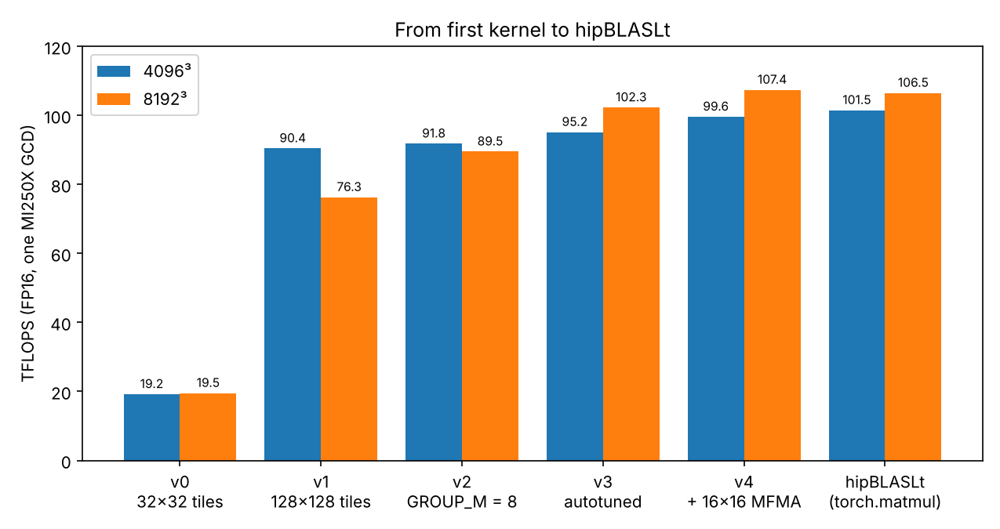

In the [previous post](/blog/mi250x-anatomy/) I took the MI250X apart: compute units, LDS, L2, HBM, and the roofline that ties them together. This post puts that map to work. I wrote a matrix multiply in Triton for one GCD of an MI250X on LUMI, starting from the simplest kernel that works, and changed one thing at a time until it caught up with AMD's own library.



The first version ran at 19 TFLOPS. The last one runs at 107 TFLOPS on an 8192³ FP16 multiply, 101% of hipBLASLt measured in the same job, and at 98% on 4096³. Every step in between came from a measurement, and three findings carry the post:

1. **The best tile depends on the shape.** No tile size wins everywhere. Autotuning lifted a one-token decode GEMM from 26% to 64% of hipBLASLt.
2. **The order of the tiles matters.** At 8192³, launching the same tiles in a different order cost 22%. Grouping, the textbook fix, never beat a plain row walk.
3. **Decode needs a different kind of kernel.** With one token, a tiled GEMM leaves dozens of compute units idle. hipBLASLt's does too.

Why care about one matmul? Matrix multiplies are most of the arithmetic in a transformer, protein language models included. Next to the usual square benchmarks, my test set has the four linear layers of ESM-2 650M [1] and the linear layers of a 7B Llama-style model, for both prefill and decode [2].

The post follows the work in order: measure the machine, write the simplest kernel, then fix one bottleneck at a time and check each fix with the compiler's report and a profiler. All code and data are in [gpu-perf-mi250x](https://github.com/huizhg/gpu-perf-mi250x).

## The setup

Everything runs on one GCD of an AMD Instinct MI250X on LUMI: 110 compute units (CUs), 64 KiB of LDS per CU, an 8 MiB L2 cache and HBM2e. The datasheet peaks per GCD are 191.5 TFLOPS for FP16 on the matrix cores and 1.6 TB/s of memory bandwidth [3]. The software is PyTorch 2.10.0 on ROCm 7.0 (HIP 7.0.51831) and Triton 3.6.0, in a container.

**The baseline is `torch.matmul`.** On this GPU, PyTorch 2.10 runs it with hipBLASLt, AMD's tuned GEMM library, not rocBLAS [4, 5]. I checked with `torch.backends.cuda.preferred_blas_library()`, which returns `Cublaslt`: PyTorch's name for hipBLASLt on ROCm. Every percentage in this post is relative to hipBLASLt.

**The shapes.** Eighteen GEMMs, $C = AB$ with A of size M × K and B of size K × N, all FP16 with FP32 accumulation:

| Family | M × N × K | What it is |
| --- | --- | --- |
| square | 512³, 1024³, 2048³, 4096³, 8192³ | the classic benchmark |
| prefill | 2048 × 4096 × 4096, 2048 × 11008 × 4096, 2048 × 4096 × 11008 | 2048 tokens through the linear layers of a 7B LLM |
| decode | 1, 4 and 16 × 4096 × 4096, 1 × 11008 × 4096 | 1 to 16 tokens through the same layers |
| ESM-2 | 1024 × 3840 × 1280, 1024 × 1280 × 1280, 1024 × 5120 × 1280, 1024 × 1280 × 5120 | a 1024-token protein sequence through ESM-2 650M: fused QKV, attention output, FFN up, FFN down |
| odd | 1000³, 3000 × 2000 × 1500 | sizes that are not multiples of the tile, to catch edge bugs |

**Timing.** `triton.testing.do_bench` with 25 ms of warm-up and 200 ms of timed runs; I report the median. Before every timed run, `do_bench` zeroes a 256 MiB buffer to flush the L2 [8], so each run starts with a cold cache. TFLOPS counts 2MNK operations. Run-to-run variation between jobs was about 3%, so I treat smaller differences between separate runs as noise. The headline numbers above come from one job, five runs of each, back to back, and so do the GROUP_M sweep and the knob table below.

**Correctness first.** Every version is checked against `torch.matmul` on all 18 shapes before it is timed: the largest error must stay below 1% of the largest output value. Timing a wrong kernel is worse than useless.

> **A number that beats physics.** My first row-order kernel (more on order below) reported 0.0134 ms for an 8192³ multiply: 82,000 TFLOPS, against a peak of 191.5. I had dropped the final `tl.store` while copying the kernel. Nothing it computed was ever written, so the compiler deleted the whole K loop as dead code. The compiled kernel was a handful of instructions long and used no vector registers at all. I had timed 4,096 programs doing nothing. Since then, any result above the datasheet peak counts as a bug.

## Measure the machine first

The datasheet numbers are the speed of light. Before writing a kernel, I measured what a real kernel can hope for:

- **Bandwidth:** copying a 512 MiB tensor runs at 1.249 TB/s, 78% of the datasheet's 1.6 TB/s.
- **Compute:** the best hipBLASLt result over four large shapes is 115.3 TFLOPS, at 3840³. That is 60% of the datasheet's 191.5.

The compute roof is empirical: it is hipBLASLt's best shape, not a hardware limit. My first attempt measured it on 8192³ alone, and two LLM shapes then landed above the "roof". Taking the best of several shapes fixed that.

The two roofs meet at the ridge point, 115.3 / 1.249 ≈ 92 FLOP per byte [9]. A kernel that does fewer FLOPs per byte of memory traffic than that is limited by bandwidth; one that does more is limited by compute.

For a GEMM, the least traffic possible is reading A and B once and writing C once. In FP16 that gives an arithmetic intensity of

$$
I = \frac{2MNK}{2\,(MK + KN + MN)}\ \text{FLOP/byte}.
$$

A square n³ GEMM has $I = n/3$: 171 FLOP/byte at 512, 1,365 at 4096. Every square, prefill, ESM-2 and odd shape sits right of the ridge, so in principle all of them can reach the compute roof. Decode cannot. With one token, the 4096 × 4096 layer reads 32 MiB of weights to do 33.5 MFLOP: one FLOP per byte. Even on the measured bandwidth roof, that caps it at 1.25 TFLOPS. For decode, the question is how close to the bandwidth roof a kernel gets.

## v0: one program, one tile

Triton's model is simple. Split the output C into tiles and launch one *program* per tile; each program runs as one workgroup on one CU. The program walks along K in chunks. At each step it loads a BLOCK_M × BLOCK_K piece of A and a BLOCK_K × BLOCK_N piece of B, multiplies them, and adds the result into an accumulator. When K runs out, it stores its tile.

Step through it here. Pick a program, then press *Next k step*:

<style>
/* The interactive embeds are wider than the text column, so the diagrams fit without sideways scrolling. */
.prose .mi250x-embed { align-self: center; width: min(1120px, calc(100vw - 32px)); }
.prose .mi250x-embed iframe { display: block; width: 100%; border: 1px solid var(--rule); border-radius: 12px; }
</style>

<script>
(function () {
  var root = document.documentElement;
  var frames = function () { return document.querySelectorAll("iframe[data-autoheight]"); };

  // Each embedded page reports its height, so its iframe grows to fit.
  window.addEventListener("message", function (e) {
    if (!e.data || e.data.type !== "mi250x-embed") return;
    frames().forEach(function (f) {
      if (f.contentWindow === e.source) f.style.height = e.data.height + "px";
    });
  });

  // The embedded pages use the site's light or dark theme, also after the toggle is clicked.
  function applyTheme() {
    var theme = root.dataset.theme;
    if (theme !== "light" && theme !== "dark") return;
    frames().forEach(function (f) {
      var url = new URL(f.src);
      if (url.searchParams.get("theme") === theme) return;
      try {
        var page = f.contentDocument && f.contentDocument.documentElement;
        if (page && page.classList.contains("is-embed")) { page.setAttribute("data-theme", theme); return; }
      } catch (err) {}
      url.searchParams.set("theme", theme);
      f.src = url.href;
    });
  }
  document.addEventListener("DOMContentLoaded", applyTheme);
  new MutationObserver(applyTheme).observe(root, { attributes: true, attributeFilter: ["data-theme"] });
})();
</script>

<figure class="mi250x-embed">
<iframe src="/interactive/gemm-one-tile.html?embed" title="One program, one tile of C: an interactive walk through a tiled matrix multiply" loading="lazy" data-autoheight style="height:960px"></iframe>
<figcaption>One program computes one tile of C. Pick a program and step along K to see which pieces of A and B it loads. <a href="/interactive/gemm-one-tile.html" target="_blank" rel="noopener">Open full screen ↗</a></figcaption>
</figure>

Here is the whole kernel. It stays the same at every size; only the three block sizes change.

```python
@triton.jit
def gemm_kernel(a_ptr, b_ptr, c_ptr, M, N, K,
                s_am, s_ak, s_bk, s_bn, s_cm, s_cn,
                BLOCK_M: tl.constexpr, BLOCK_N: tl.constexpr,
                BLOCK_K: tl.constexpr):
    # Which tile of C is mine?
    pid_m = tl.program_id(0)
    pid_n = tl.program_id(1)
    offs_m = pid_m * BLOCK_M + tl.arange(0, BLOCK_M)  # rows of C
    offs_n = pid_n * BLOCK_N + tl.arange(0, BLOCK_N)  # columns of C
    offs_k = tl.arange(0, BLOCK_K)        # positions in one K chunk

    # Pointer grids for the first K chunk of A and of B
    a_ptrs = a_ptr + offs_m[:, None] * s_am + offs_k[None, :] * s_ak
    b_ptrs = b_ptr + offs_k[:, None] * s_bk + offs_n[None, :] * s_bn

    # FP32 accumulator: summing in FP16 would lose precision
    acc = tl.zeros((BLOCK_M, BLOCK_N), dtype=tl.float32)
    for k0 in range(0, K, BLOCK_K):
        a_mask = (offs_m[:, None] < M) & (k0 + offs_k[None, :] < K)
        b_mask = (offs_n[None, :] < N) & (k0 + offs_k[:, None] < K)
        a = tl.load(a_ptrs, mask=a_mask, other=0.0)
        b = tl.load(b_ptrs, mask=b_mask, other=0.0)
        acc += tl.dot(a, b)            # MFMA on the matrix cores
        a_ptrs += BLOCK_K * s_ak       # slide both windows along K
        b_ptrs += BLOCK_K * s_bk

    c_ptrs = c_ptr + offs_m[:, None] * s_cm + offs_n[None, :] * s_cn
    c_mask = (offs_m[:, None] < M) & (offs_n[None, :] < N)
    tl.store(c_ptrs, acc.to(tl.float16), mask=c_mask)
```

The launch makes one program per output tile:

```python
grid = (triton.cdiv(M, BM), triton.cdiv(N, BN))   # one per tile
gemm_kernel[grid](a, b, c, M, N, K,
                  a.stride(0), a.stride(1), b.stride(0), b.stride(1),
                  c.stride(0), c.stride(1),
                  BLOCK_M=BM, BLOCK_N=BN, BLOCK_K=BK)
```

Three details carry the whole kernel:

- **Pointers are grids.** `offs_m[:, None]` is a column and `offs_k[None, :]` is a row. Adding them broadcasts to a BLOCK_M × BLOCK_K grid of addresses: exactly one tile of A. `tl.load` fetches the whole tile at once.
- **Masks guard the edges.** On a 1000 × 1000 matrix, the last tiles hang over the edge. The mask turns those loads into zeros, which add nothing to the dot product. The odd shapes exist to catch a missing mask.
- **The window slides; it must not stretch.** The pointer update moves every address by the same BLOCK_K columns. The tempting `a_ptrs += offs_k[None, :] * s_ak` moves column j by j columns instead, so the window stretches and the kernel reads the wrong K positions. The test catches it at once. A benchmark never would.

**v0** uses 32 × 32 tiles with BLOCK_K = 32. It passes all 18 shapes and runs at 19.2 TFLOPS on 4096³: 19% of hipBLASLt.

## v1: bigger tiles

Why should the tile size matter? Look at one step of the K loop. A program loads BLOCK_M × BLOCK_K values of A and BLOCK_K × BLOCK_N values of B, and does 2 × BLOCK_M × BLOCK_N × BLOCK_K FLOPs with them. In FP16 that gives a *tile intensity* of

$$
\frac{2\,B_M B_N B_K}{2\,(B_M + B_N)\,B_K} = \frac{B_M B_N}{B_M + B_N}\ \text{FLOP/byte}.
$$

Think of it geometrically: the work grows with the tile's area, the data with its edges. Double the side of a square tile, and every byte loaded feeds twice the math. A 32 × 32 tile gives 16 FLOP/byte; a 128 × 128 tile gives 64.

That gives a prediction before running anything. Assume the worst case, that every tile load comes from HBM. Then the bandwidth roof caps each tile size at its intensity × 1.25 TB/s: about **20 TFLOPS** for 32 × 32 and **80 TFLOPS** for 128 × 128.

**v1** is the same kernel with 128 × 128 × 32 tiles. On 4096³:

| | Tile intensity | HBM-only ceiling | Measured |
| --- | --- | --- | --- |
| v0, 32 × 32 | 16 FLOP/byte | 20 TFLOPS | 19.2 TFLOPS |
| v1, 128 × 128 | 64 FLOP/byte | 80 TFLOPS | 90.4 TFLOPS |

The model sends every load to HBM and ignores the caches, so it gives a pessimistic ceiling, not a forecast. v0 lands almost exactly on it, which is more agreement than a model this crude deserves. What the model gets right is the ratio: four times the intensity, 4.7 times the speed.

v1 runs faster than its HBM-only ceiling, and that tells us something. To deliver 90.4 TFLOPS at 64 FLOP per byte, the tile loads must arrive at 1.41 TB/s. HBM delivered 1.25 TB/s in the copy test. So part of the traffic never reached HBM: when two programs need the same strip of A or B at about the same time, the second one finds it in the 8 MiB L2.

v1 also has two problems:

- **It falls at 8192³**, to 76.3 TFLOPS from 90.4 at 4096³.
- **It loses to v0 on small and thin shapes.** On the decode shape 1 × 4096 × 4096, v0 is 1.6 times faster. Count the programs: with 128-wide tiles, N = 4096 gives only 32 of them for 110 CUs, so 78 CUs sit idle. 32-wide tiles give 128 programs, enough to reach every CU. 512³ shows the same effect, with only 16 tiles of 128 × 128.

The first problem is about which programs run together. The second is about tile size. I took them in that order.

## v2: grouped launch order

v1's drop at 8192³ is about which programs run at the same time, because programs that run together can share data in the L2. Programs on the same tile row of C all read the same strip of A; programs on the same tile column all read the same strip of B. The Triton tutorial's answer is to launch the programs in groups [10], and that is the one thing v2 adds to v1.

The grid becomes one-dimensional, and a new parameter, GROUP_M (GROUP_SIZE_M in the tutorial), decides which tile each program ID gets. Programs fill a band GROUP_M tile rows tall, walking down each column of the band before moving one column right. These lines replace v1's two `program_id` lines; the rest of the kernel stays the same:

```python
pid = tl.program_id(0)                     # now a 1-D grid
num_pid_m = tl.cdiv(M, BLOCK_M)
num_pid_n = tl.cdiv(N, BLOCK_N)
num_in_group = GROUP_M * num_pid_n         # programs per band
first_m = (pid // num_in_group) * GROUP_M  # top tile row of my band
# The last band can be shorter than GROUP_M
group_size_m = min(num_pid_m - first_m, GROUP_M)
pid_m = first_m + (pid % num_in_group) % group_size_m
pid_n = (pid % num_in_group) // group_size_m
```

Step through it, and switch between GROUP_M = 1, 3 and 7:

<figure class="mi250x-embed">
<iframe src="/interactive/gemm-launch-order.html?embed" title="Grouped tile ordering: which tile of C each program id gets for a given GROUP_M" loading="lazy" data-autoheight style="height:1300px"></iframe>
<figcaption>Grouped launch order on a 7 × 6 grid of tiles. Change GROUP_M and watch which tiles run together. <a href="/interactive/gemm-launch-order.html" target="_blank" rel="noopener">Open full screen ↗</a></figcaption>
</figure>

Two settings are special. GROUP_M = 1 makes every band one tile row tall: a plain row walk. GROUP_M equal to the number of tile rows makes one band of the whole matrix: a pure column walk. The counter under the grid adds up the strips of A and B that the programs running at the same time need. If each strip came from HBM once and from the L2 after that, the counter would be the HBM traffic. Grouping needs fewer strips than either walk, and by this count a row walk and a column walk on a square grid cost about the same.

I expected v2 to fix 8192³. Here is the sweep with v1's 128 × 128 × 32 tiles, in TFLOPS, measured in one job:

| GROUP_M | 1 | 4 | 8 | 16 | 32 | 64 |
| --- | --- | --- | --- | --- | --- | --- |
| 4096³ | 92.0 | 92.1 | 91.8 | 91.8 | 91.4 | 91.4 |
| 8192³ | 98.0 | 97.8 | 89.5 | 81.4 | 77.5 | 76.6 |

v2 with GROUP_M = 8, its default and the value in the tutorial's NVIDIA configurations, does lift 8192³ from v1's 76.3 to 89.5 TFLOPS. But the smallest groups do best. GROUP_M = 1, no grouping at all, reaches 98.0, and GROUP_M = 4 is within noise of it. From GROUP_M = 8 on, every larger group is slower, and GROUP_M = 8 itself still costs 9%. At 4096³ the setting makes no difference: every value lands within 1%. Grouping was not the fix.

### What v1 was really doing

The answer was in v1's launch. Its grid is two-dimensional, with `pid_m = tl.program_id(0)`. The GPU dispatches workgroups in the order of their IDs, and the first grid dimension changes fastest. So v1's consecutive programs walk *down a column* of C: they share one strip of B, and each needs a different strip of A. v1 was a pure column walk all along, the same order as v2 with GROUP_M = 64, and the two run at the same speed (76.3 and 76.6 TFLOPS). v2's extra index arithmetic costs nothing.

The direct test is to swap the two `program_id` lines in v1, and the two grid dimensions with them, so that consecutive programs walk *along a row* of C:

| Launch order | 4096³ | 8192³ |
| --- | --- | --- |
| v1, column walk | 90.4 TFLOPS | 76.3 TFLOPS |
| v1, row walk | 91.6 TFLOPS | 98.2 TFLOPS |

The row walk matches v2 with GROUP_M = 1 (98.2 against 98.0). On the other 16 shapes the two orders agree within 2.5%. So the order only matters at 8192³, and there the column walk costs 22%. In the sweep, the loss grows with the band height, and the knee sits between GROUP_M = 4 and 8: between 512 and 1,024 rows of A being read at the same time.

Why? Four explanations failed before I found one that fits:

- *Symmetry.* My first prediction was that row and column order would tie on a square problem. They don't.
- *Short reads.* Each row of an A tile is 64 bytes and each row of a B tile 256, so a column walk fetches A in small pieces. But then 4096³ would suffer too, and it doesn't.
- *L2 capacity.* With GROUP_M = 16, both sizes read the same 128 KiB of A per K step. Only 8192³ slows down.
- *Address translation.* 8192³ with GROUP_M = 8 reads fewer rows of A, spread over a smaller address range, than 4096³ with a full column walk. It still loses.

What is left is the distance between rows. Both walks reuse their shared strip equally well; what differs is the shape of the strip they don't share. In a column walk, the programs running together each own a different block of rows of A. At every K step they all read the same 32 columns, each from its own rows: 64-byte pieces from hundreds of rows at once. Consecutive rows of A start 2 × K bytes apart, 8 KiB at 4096 and 16 KiB at 8192. The L2 picks one of its 32 channels from a hash of the address bits (see the [previous post](/blog/mi250x-anatomy/)). Addresses that differ by a large power of two share many of those bits, so these reads can pile up on a few channels or cache sets while the rest wait. A row walk avoids this. The programs in flight cover only a few tile rows, so they share the same strips of A, which the L2 keeps. Most of what comes from HBM is then B, read in long contiguous rows.

This is a working explanation, not a proven one. AMD does not publish the MI250X's address hash, so the threshold has to be measured, not derived. The test is ready: pad each row of A by 64 elements, so rows sit 16,512 bytes apart, and rerun the column walk at 8192³. If it recovers to about 98 TFLOPS, the stride is the cause.

The practical lesson holds either way. Launch order is a tuning parameter, not a default.

## v3: let the autotuner pick the tile

v0 against v1 already showed that no single tile wins everywhere. So v3 stops choosing one. It keeps v2's kernel, GROUP_M = 8 included, and wraps it in Triton's autotuner with a list of candidates, which it times on the first call for each new shape:

```python
TILES = [(32, 64), (64, 64), (64, 128),
         (128, 128), (128, 256), (256, 128)]
CONFIGS = [
    triton.Config({"BLOCK_M": bm, "BLOCK_N": bn, "BLOCK_K": bk,
                   "GROUP_M": 8},
                  num_warps=nw, num_stages=2)
    for (bm, bn), bk, nw in itertools.product(TILES, [32, 64], [4, 8])
]   # 6 tiles x 2 BLOCK_K x 2 warp counts = 24 candidates
gemm_kernel_v3 = triton.autotune(configs=CONFIGS,
                                 key=["M", "N", "K"])(gemm_kernel_v2)
```

`num_warps` is the number of wavefronts per program; on AMD, a Triton "warp" is a 64-thread wavefront. With `key=["M", "N", "K"]`, every new shape starts a fresh search. The launch grid becomes a function of the chosen config, because the number of tiles depends on the tile size.

| Shape | v1, % of hipBLASLt | v3, % of hipBLASLt | v3's pick: tile, wavefronts |
| --- | --- | --- | --- |
| 512³ | 46% | 90% | 64 × 64 × 64, 4 |
| 4096³ | 89% | 94% | 128 × 256 × 32, 8 |
| 8192³ | 72% | 96% | 128 × 256 × 32, 8 |
| prefill, 2048 × 11008 × 4096 | 84% | 85% | 128 × 128 × 64, 8 |
| decode, 1 × 4096 × 4096 | 26% | 64% | 64 × 64 × 64, 4 |
| ESM-2 FFN down, 1024 × 1280 × 5120 | 58% | 85% | 128 × 128 × 64, 8 |

Two forces decide each winner. Bigger tiles raise the intensity, so the large square shapes pick 128 × 256. Smaller tiles make more programs, so decode picks 64 × 64 and gets 64 programs instead of 32; 512³ gets 64 tiles instead of 16. Not every gain comes from the tile count, though. The ESM-2 down-projection keeps 128 × 128 tiles and gains from BLOCK_K = 64 and 8 wavefronts. The search found that; my reasoning didn't. At 8192³, part of the gain is v2's: its launch order alone had taken v1's 72% to 84%, and the bigger tile did the rest.

## v4: the 16 × 16 instruction

`tl.dot` compiles to MFMA instructions, and on CDNA 2 Triton can use two sizes, chosen by `matrix_instr_nonkdim`: 32 × 32 (`v_mfma_f32_32x32x8f16`, Triton's default for all of the tiles above) or 16 × 16 (`v_mfma_f32_16x16x16f16`). AMD's Triton guide recommends 16 × 16 for GEMMs on the MI300X [11], and Triton's own tutorial sets it in every AMD configuration [10]. I tested both on the 4096³ winner, together with a second knob, `waves_per_eu`:

| TFLOPS for `waves_per_eu` = | 0 (default) | 1 | 2 | 3 |
| --- | --- | --- | --- | --- |
| 4096³, 32 × 32 MFMA | 95.0 | 95.0 | 85.6 | 85.9 |
| 4096³, 16 × 16 MFMA | 99.4 | 99.2 | 85.9 | 86.1 |
| 8192³, 32 × 32 MFMA | 100.9 | 100.8 | 91.2 | 91.2 |
| 8192³, 16 × 16 MFMA | 106.8 | 106.7 | 92.0 | 92.1 |

The 16 × 16 instruction is 5% faster at 4096³ and 6% faster at 8192³, so the MI300X advice holds on the MI250X too. `waves_per_eu` of 2 or 3 costs 10 to 14%; the next section shows why.

**v4** is v3's search with `matrix_instr_nonkdim = 16` on every config. Measured back to back in one job, median of five runs:

| | v4 | hipBLASLt | v4 / hipBLASLt |
| --- | --- | --- | --- |
| 4096³ | 99.6 TFLOPS | 101.5 TFLOPS | 98% |
| 8192³ | 107.4 TFLOPS | 106.5 TFLOPS | 101% |

The five runs of each spread by less than 0.5%, so within this job the gaps are real: v4 is 2% behind at 4096³ and 1% ahead at 8192³.

Forcing 16 × 16 everywhere has a cost. On two ESM-2 shapes, v3 had picked a 32 × 32 config that v4 can no longer choose, and v4 is slower there: 91% of hipBLASLt instead of 96% on 1024 × 1280 × 1280, and 76% instead of 85% on 1024 × 1280 × 5120. Searching both instruction sizes would let the autotuner keep 32 × 32 where it wins.

## Look inside the compiled kernel

Timing says how fast. The compiler's output says why. Triton keeps everything it generates in its cache directory, `TRITON_CACHE_DIR`, one folder per compiled kernel: Triton's intermediate representations (`.ttir`, `.ttgir`), LLVM IR, the AMD GPU assembly (`.amdgcn`) and a `.json` of metadata. Compile one config into an empty cache, and two commands tell you most of what you need:

```bash
grep -hE "Vgprs|Agprs|ScratchSize|Occupancy|LDSByteSize" \
    $(find $TRITON_CACHE_DIR -name "*.amdgcn")
grep -ho '"shared": *[0-9]*' $(find $TRITON_CACHE_DIR -name "*.json")
```

For v3's 4096³ winner, a 128 × 256 × 32 tile with 8 wavefronts per workgroup:

```text
; NumVgprs: 107
; NumAgprs: 0
; TotalNumVgprs: 107
; ScratchSize: 0
; LDSByteSize: 0 bytes/workgroup (compile time only)
; Occupancy: 4
"shared": 24576
```

The same folder shows the hardware from the previous post at work. The assembly is built around `v_mfma_f32_32x32x8f16` instructions: that is `tl.dot` on the matrix cores. The `.ttgir` file records how the tiles sit in the LDS, `#ttg.swizzled_shared<{vec = 4, perPhase = 2, maxPhase = 8, order = [1, 0]}>`, which is the XOR swizzle Triton applies to avoid LDS bank conflicts. And `ScratchSize: 0` says no registers spilled.

**Occupancy by hand.** Two resources decide how many wavefronts each SIMD holds. Count in whole workgroups, because all wavefronts of a workgroup must fit on one CU:

- *Registers.* 107 rounds up to 112, since registers are allocated in blocks of 8. 512 / 112 = 4.6, so 4 wavefronts per SIMD, 16 per CU: room for 2 workgroups of 8.
- *LDS.* Each workgroup asks for 24,576 bytes: the 128 × 32 tile of A plus the 32 × 256 tile of B, in FP16. 65,536 / 24,576 = 2.7, so 2 workgroups per CU.

Both limits land on 2 workgroups per CU: 16 wavefronts, 4 per SIMD. The compiler's `Occupancy: 4` agrees.

**The compiler cannot see the LDS.** Look at `LDSByteSize: 0`. Triton requests its LDS when it launches the kernel, so the compiled code declares none, and the compiler's occupancy counts registers only. Here that happens to give the right answer. It doesn't for v3's 1024³ winner, a 64 × 128 × 64 tile with 4 wavefronts: the compiler reports 5, but 24,576 bytes of LDS per workgroup allow 2 workgroups of 4 wavefronts, which is 2 per SIMD. Take the `shared` number from the `.json` and do the LDS half yourself.

**What `waves_per_eu` really does.** In Triton 3.6, `waves_per_eu = N` sets the LLVM attribute `"amdgpu-waves-per-eu"="N, N"` [10, 11]. For N ≥ 1, that asks the compiler for at least N and at most N wavefronts per SIMD. The default, N = 0, is special: `"0, 0"` means no limit. For this kernel the "at least" half never matters, because 107 registers already leave room for 4 wavefronts. The "at most" half is what hurts. The compiler can't make a wavefront use more registers than its code needs, so it enforces the cap by *declaring* more in the kernel descriptor (`.amdhsa_next_free_vgpr`). It picks a number just high enough that one more wavefront no longer fits in the SIMD's 512 registers, and the hardware reserves that many for every wavefront. Here is each setting for the 4096³ winner, with its speed from the table above:

- **N = 0**, no limit. 107 registers, allocated as 112 because registers come in blocks of 8. 512 / 112 = 4.6, so 4 wavefronts per SIMD, 16 per CU: two workgroups of 8. 95.0 TFLOPS.
- **N = 1**, impossible. A workgroup of 8 wavefronts spreads over 4 SIMDs, so it needs at least 2 per SIMD. The compiler ignores the request, and the kernel is identical to N = 0. 95.0 TFLOPS.
- **N = 2.** Declared 169, allocated as 176. Three wavefronts would need 3 × 176 = 528 registers, more than 512, so only 2 fit per SIMD: 8 per CU, one workgroup. 85.6 TFLOPS.
- **N = 3.** Declared 129, allocated as 136. Four would need 544, so 3 fit per SIMD: 12 per CU. A second workgroup would need 16, so again only one fits. 85.9 TFLOPS.

That is why 2 and 3 cost the same 10 to 14%. Both drop the CU from two workgroups to one, and neither saves a single register.

So occupancy matters for this kernel: two workgroups per CU hide latency that one cannot.

## Check the numbers with a profiler
A harness can fool you; a profiler records what the GPU actually ran. `rocprofv3 --kernel-trace` logs every kernel launch with its name, duration and resources [14]. I ran one shape at a time through a small script, 10 warm-up calls and then 50 timed ones:

```bash
rocprofv3 --kernel-trace --stats --output-format csv \
    -d results/prof -o triton_4096 -- \
    python -m bench.run_one --impl triton --M 4096 --N 4096 --K 4096
```

**Do the harness numbers hold up?** For the large kernels, yes:

| Run | Kernel time in the trace | Harness time | Difference |
| --- | --- | --- | --- |
| hipBLASLt, 4096³ | 1,313 µs | 1,359 µs | +3.5% |
| v4, 4096³ | 1,350 µs | 1,377 µs | +2.0% |
| hipBLASLt, 2048 × 11008 × 4096 | 1,619 µs | 1,661 µs | +2.6% |
| v4, 2048 × 11008 × 4096 | 1,820 µs | 1,847 µs | +1.5% |
| hipBLASLt, 1 × 4096 × 4096 | 40.5 µs | 48.5 µs | +19.6% |
| v4, 1 × 4096 × 4096 | 63.2 µs | 74.2 µs | +17.5% |

The large kernels agree within 1.5 to 3.5%. That is about the run-to-run variation between jobs, and the harness and the profiler ran in different jobs. The decode GEMMs differ by 18 to 20%, because two small effects that the large kernels hide add up on a 40 to 60 µs kernel.

First, the harness times every call right after `do_bench` flushes the L2, and the profiling script doesn't. The trace shows what that costs: while autotuning, the winning decode config also ran right after a flush, 364 times, and there it took 67.0 µs against 63.5 µs back to back. That is 3.5 of the 11 µs for v4.

Second, the two tools count different things. The harness brackets each call with two GPU events, so it also counts the GPU's work of starting the kernel and finishing it. The profiler records only the kernel's own run. It isn't CPU time: in `do_bench` the 200 µs flush runs first, and the CPU has the GEMM queued long before the GPU reaches it. I haven't measured this part on its own. A few microseconds is invisible next to a 1.3 ms kernel; next to a 40 µs one, it is a large share of the time.

**Two traps in the Triton traces.** The trace records every kernel the script launches, including all the work the autotuner does on the first call. That work distorts the numbers in two ways.

First, the autotuner's trials share the winner's name. v4 is v2's kernel inside the autotuner, so all 24 candidate configs run as `gemm_kernel_v2`, just like the winner. The 4096³ trace holds 1,714 calls to it, not 60. Averaged over all of them, it reports 1,701 µs per call, but most of those calls are slower candidates. The 50 timed calls at the end, all with the winning config, average 1,350 µs.

Second, the busiest kernel may not be a GEMM. In the decode trace, the kernel with the most total time is a fill kernel, called about 6,300 times at about 200 µs each. It also comes from autotuning: before every run it times, `do_bench` zeroes a 256 MiB buffer to flush the L2. That flush takes three times as long as the 63 µs decode GEMM it precedes.

So before reading a trace, drop the fill kernels and keep only the last 50 calls of the main kernel. The table above does both.

**What hipBLASLt actually runs.** Its kernel names are long but readable: `MT256x128x32` is the macro tile, 256 × 128 with K steps of 32, and `MI32x32x1` is the MFMA instruction. The trace adds each kernel's resources:

| Shape | Macro tile | MFMA | Workgroups | LDS per workgroup | Registers reserved per lane |
| --- | --- | --- | --- | --- | --- |
| 4096³ | 256 × 128 × 32 | 32 × 32 | 512 | 64 KiB | 384 |
| 2048 × 11008 × 4096 | 256 × 208 × 32 | 16 × 16 | 430 | 64 KiB | 464 |
| 1 × 4096 × 4096 | 64 × 16 × 64 | 16 × 16 | 64 | 27 KiB | 56 |

Three details stand out.

**hipBLASLt makes the opposite trade from my kernel.** At 4096³, each of its workgroups has 4 wavefronts that each reserve 384 of a SIMD's 512 registers per lane, and it takes all 64 KiB of LDS. One workgroup fits per CU: one wavefront per SIMD, against four in my kernel. With no other wavefront to switch to, hipBLASLt has to hide memory latency inside each wavefront, issuing loads for later tiles while it computes the current one. Two opposite designs land within 2% of each other.

**The prefill tile is 208 wide.** Not a power of two. My guess is that it fills the GPU evenly. 11008 splits into exactly 43 tiles of 256, and 2048 into 10 tiles of 208, which makes 430 tiles. At one workgroup per CU that is 3.9 rounds of 110 CUs, and the last round is 91% full. A 256 × 256 tile would give 43 × 8 = 344 tiles: 3.1 rounds, with the last round 13% full. That is a hypothesis; hipBLASLt doesn't say why it picks a kernel.

**Decode gets no special kernel.** hipBLASLt does not switch to a matrix-vector routine. It picks a thin 64 × 16 tile from the same GEMM family, which gives 64 workgroups. My v4 picks 32 × 64 tiles, which also gives 64. That number explains most of the decode story below.

## Where it lands


**Large shapes sit near the roof.** v4 reaches 107 TFLOPS on 8192³, 93% of the measured roof. On the three prefill shapes it reaches 86 to 90% of hipBLASLt, and on the four ESM-2 shapes 76 to 103%.

**Small shapes sit far below it.** 512³ reaches 15 TFLOPS with hipBLASLt and 14 with v4, about 8 times below the roof. The whole multiply is 0.27 GFLOP, 2.3 µs of work at the roof. That is too little to keep 110 CUs busy for long, the harness also counts a few microseconds of per-call overhead, as the profiler comparison showed.

**Decode sits below the slope.** The roof there is 1.25 TFLOPS. hipBLASLt reaches 55% of it on 1 × 4096 × 4096 and 90% on 1 × 11008 × 4096; v4 reaches 36% and 75%. Per-call overhead explains part of the gap, but not the difference between the two shapes. Parallel work does. With N = 4096, both kernels launch 64 workgroups, so at least 46 of the 110 CUs have nothing to do. Streaming memory at full speed takes many loads in flight at once, and loads only come from busy CUs. Even counting the kernel's own time alone, hipBLASLt moves 830 GB/s, 66% of the copy bandwidth, and v4 530 GB/s, 43%. N = 11008 has 2.7 times more columns to split up, and both kernels get much closer to the roof.

This is what "decode needs a different kind of kernel" means: not a different tile, a different way of splitting the work. vLLM ships one for exactly this case on ROCm, `wvSplitK` [15]. It launches one workgroup per CU, so every CU works however thin the matrix is. Each wavefront owns one or a few output columns, and its 64 lanes split the K dimension between them. When I profiled vLLM serving Qwen2.5-VL-7B on this GPU, it was one of the top kernels by time. Splitting K across workgroups, split-K, is the other textbook fix. I haven't tried either yet.

## What I don't understand yet

- **Why the column walk collapses at 8192³ and not at 4096³.** The stride explanation fits every test so far. The padding test, and L2 hit-rate counters from ROCm Compute Profiler, will confirm it or kill it.
- **Why hipBLASLt uses the 32 × 32 instruction at 4096³** while my kernel is 5% faster with 16 × 16. With one wavefront per SIMD against four, the best instruction may simply differ.
- **The rest of the gap on decode calls.** After the L2 flush, a few microseconds per call remain unexplained. Profiling the harness itself, events and flushes included, would show where they go.
- **Two loose ends in my own search.** GROUP_M stayed fixed at 8 in v3 and v4, and v4 forced 16 × 16 on every config. Both belong in the search space.

## Reproduce it

Everything is in [gpu-perf-mi250x](https://github.com/huizhg/gpu-perf-mi250x). On a GPU node, from the repository root:

```bash
python -m tests.test_gemm        # all versions vs torch.matmul
python -m bench.ceilings         # measured roofs
python -m bench.run_rocblas      # baseline: torch.matmul (hipBLASLt)
python -m bench.run_triton       # v0 and v1
python -m bench.run_v2_group     # v2: the GROUP_M sweep
python -m bench.run_v1_rows      # v1 with a row walk
python -m bench.run_v4_autotune  # the final kernel
python -m bench.compare results/triton_v1.csv results/triton_v4.csv
python plots/roofline.py results/rocblas.csv results/triton_v4.csv \
    plots/roofline_final.png
```

On LUMI I run them inside a PyTorch container on one GCD of the `small-g` partition; `env.sh` and `get_a_gpu.sh` in the repository set that up.

## Wrapping up

- **Measure your roofs.** On one GCD: 1.25 TB/s and 115 TFLOPS, 78% and 60% of the datasheet. Every percentage means more against numbers you can actually reach.
- **Check every result against `torch.matmul` and against physics.** A kernel that beats the peak is broken.
- **Write the prediction down first.** Tile intensity needs two numbers you already have, and it gave HBM-only ceilings of 20 and 80 TFLOPS for v0 and v1. When a prediction failed, like my guess that a square problem doesn't care about launch order, it narrowed the explanation.
- **Sweep the variable.** One run said the order matters. The GROUP_M sweep said how much, and 4096³ against 8192³ pointed at why.
- **Tile size, launch order and the MFMA instruction all depend on the shape.** Tune them per shape.
- **Decode is a different problem.** It is short of parallel work, not of a better tile.

### Next: a whole model

This post optimized one operation. The next one puts it inside a model: ESM-2 3B, embedding 10,000 real proteins from Swiss-Prot on the same GCD. The question is how many proteins per GPU-hour it can embed, and where the time goes. I'll work down the stack: a speed-of-light estimate first, then the profiler and `torch.compile`, then a hand-fused version of the FFN up-projection GEMM benchmarked here, against what Inductor generates. The last step is the pipeline around the model: batching proteins by length, so short ones stop paying for the padding of long ones.
